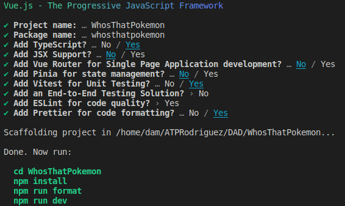
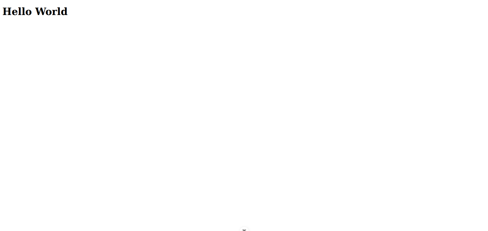

<div align="center">

# ***_Whos That Pokemon_***

</div>

<div align="justify">

## **Índice**
- [Preguntas](#preguntas)
  - [Pregunta 1](#p1)
  - [Pregunta 2](#p2)
  - [Pregunta 3](#p3)
  - [Pregunta 4](#p4)
- [Pasos a seguir](#pasos)
  - [Paso 1](#1)
  - [Paso 2](#2)

   

___

## **Preguntas** <a name="preguntas"></a>
- ### *¿Para qué sirve Vue Router, Pinia, Vitest, ESLint y Prettier?* <a name="p1"></a>
- ### *¿Qué es Composition API y en qué se diferencia de Option API en VueJS?* <a name="p2"></a>
- ### *¿Qué es screaming architecture y qué ventajas tiene?* <a name="p3"></a>

- ### *¿Cómo le indicamos a Vue que usaremos TS en vez de JS?*<a name="p4"></a>

## **Pasos a seguir** <a name="pasos"></a>
  - ### *Paso 1: Crear el proyecto Vue* <a name="1"></a>
    Siguiendo el siguiente comando creamos el proyecto Vue:
    ```bash
    npm create vue@latest
    ```
    Y a continuacion seleccionamos las siguientes opciones:  
    

    Nuestro Pokemon Game lo vamos a realizar siguiendo [Composition API](#p2) y además, nuestra estructura de archivos va a estar basada en [screaming architecture.](#p3)

 - ### *Paso 2: Modificar el proyecto base de Vue* <a name="2"></a>
    - Borrar el contenido de App.vue y deja la estructura básica de VueJS teniendo en cuenta que usaremos Composition API. Recuerda que vamos a utilizar TS en lugar de JS.

    - Añadir un mensaje "Hello World" a App.vue

    - En la carpeta de assets, borra los archivos base.css y logo.svg

    - Cambia el nombre de main.css de la carpeta assets a styles.css y modifica la ruta en el archivo main.ts para que funcione correctamente nuestra hoja de estilo.

    - Ejecuta el comando npm run dev y muestra el resultado.
    
 
 - ### *Paso 3: Configurar Tailwind CSS*
    - Configura el proyecto para hacer uso de Tailwind CSS. Consulta la documentación oficial y aplica los cambios donde sea necesario tal y como se indica. 

        - Instalar Tailwind via npm
        ```bash
        npm install -D tailwindcss@latest postcss@latest autoprefixer@latest
        ```

        - Crear los ficheros de configuracion

</div>